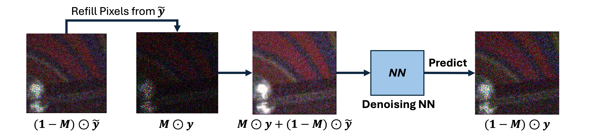

# [Zero-Shot Blind-Spot Image Denoising via Cross-Scale Non-Local Pixel Refilling](https://neurips.cc/virtual/2025/poster/118602)

This repository contains the official pytorch implementation for "Zero-Shot Blind-Spot Image Denoising via Cross-scale Non-local Pixel Refilling", NeurIPS 2025.


## Overview

The goal of this project is to perform single image denoising. By running `SIDD_validation_**.py`, you can execute the self-supervised denoising process to test the subset images in folder `SIDD_subset`. The logs and denoised results will be saved in the `output_logs` folder. The auxiliary image for pixel refilling can be verified by executing the code `utils.py` and saved in the `patch_matching` folder. `submit_utils` contains our denoised results and code for submitting the denoised results on SIDD benchmark and DND datasets.
 
## Prerequisites

- **Python**: Version 3.8,
- **PyTorch**: 2.4.1=py3.8_cuda12.4_cudnn9.1.0_0
- **Requirements**: 
  - `opencv-python`
  - `numpy`

## Dataset handler and testing instruction

Thanks for the great work by [AP-BSN](https://github.com/wooseoklee4/AP-BSN), we directly use their dataset handler to conveniently organize the dataset by executing their code following their instruction.
First, clone the repo and download the SIDD validation and benchmark dataset from [SIDD official website](https://www.eecs.yorku.ca/~kamel/sidd/).

```
git clone https://github.com/wooseoklee4/AP-BSN.git
```

Then, put the downloaded `.mat` files in `AP-BSN/dataset/SIDD/` folder, and execute the code below to prepare the dataset.

```
python prep.py -d SIDD_val -s 256 -o 0
python prep.py -d SIDD_benchmark -s 256 -o 0
```

And you will get data directory as below:
```
AP-BSN
├─ dataset
│  ├─ SIDD
│  │  ├─ BenchmarkNoisyBlocksSrgb.mat
│  │  ├─ ValidationGtBlocksSrgb.mat
│  │  ├─ ValidationNoisyBlocksSrgb.mat
│  ├─ prep
│  │  ├─ SIDD_benchmark_s256_o0
│  │  │  ├─ RN
│  │  ├─ SIDD_val_s256_o0
│  │  │  ├─ CL
│  │  │  ├─ RN
```

Then you can change the default path for validation dataset in our provided code as:

```
--path_CL ./AP-BSN/dataset/prep/SIDD_val_s256_o0/CL 
--path_RN ./AP-BSN/dataset/prep/SIDD_val_s256_o0/RN 
```

Or for benchmark dataset, change the default path according to the above directory structure, and execute the code below for testing.

```
    python SIDD_ben_DBSNl.py \
    --path_CL ./AP-BSN/dataset/prep/SIDD_benchmark_s256_o0/RN \
    --path_RN ./AP-BSN/dataset/prep/SIDD_benchmark_s256_o0/RN \
    --output_dir ./output_logs/ben_0.2_mask0.3_2000
```

We provide our experiment logs in `./output_logs/SIDD_validation_final_psnr_results_0.2_mask0.3_DBSNl.txt` and denoised results in `./submit_utils/test_result`.

## Demo

We give a demo for subset of SIDD validation dataset, you can directly run the code below to test the performance on SIDD validation dataset. If you want to test on the whole validation dataset, please follow the instruction above to prepare the dataset.

```
    python SIDD_validation_DBSNl.py
```

Our strategy can also be applied to UNet based blind-spot, we also provide a demo for UNet based blind-spot network on SIDD validation dataset.

```
    python SIDD_validation_UNet.py
```

You can also test both on the whole SIDD validation dataset and benchmark dataset by changing the path of dataset in the code following the similar way above.
